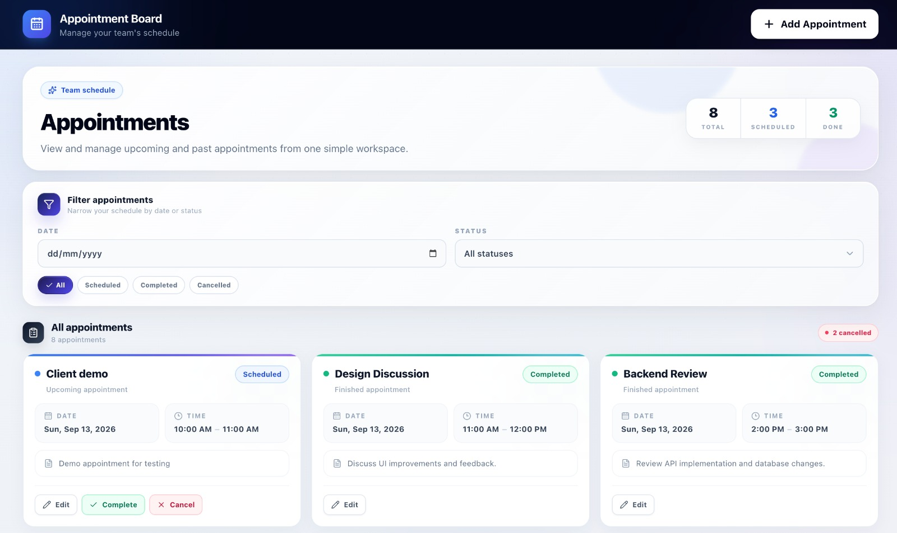
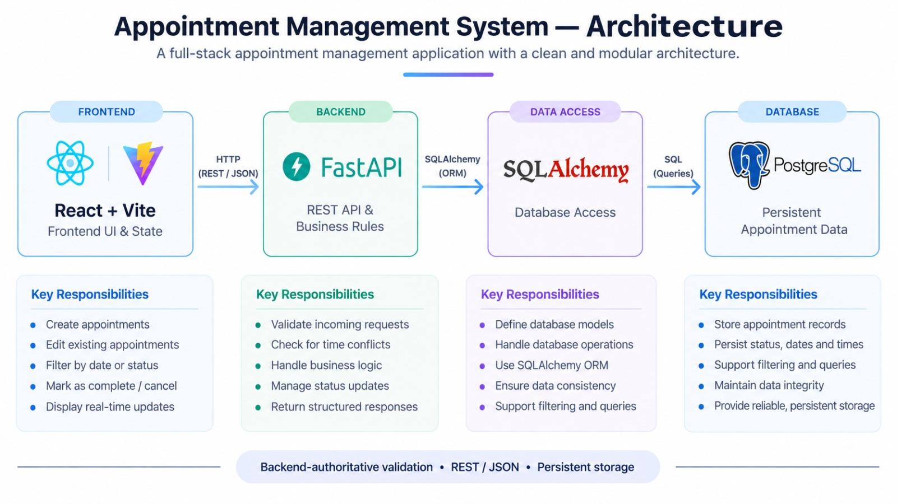

# Appointment Board

### Full-Stack Appointment Management for Small Teams

Create, manage, filter and track appointments from one clean workspace.

 

  

---

## 🎯 What I Built

### Create → Manage → Complete / Cancel → Track

Appointment Board is a full-stack scheduling application designed for a small team workflow.

It combines appointment management, filtering, persistent storage and server-side time-slot protection in one interface.

---

## 🛠️ Technology Stack

<table width="100%">

<tr>

<td width="18%" align="center">

### Frontend

</td>

<td align="left">

</td>

</tr>

<tr>

<td width="18%" align="center">

### Backend

</td>

<td align="left">

</td>

</tr>

<tr>

<td width="18%" align="center">

### Database & Tools

</td>

<td align="left">

</td>

</tr>

</table>

---

## 🏗️ Architecture

---

## 🔄 How the Application Works

| 👤 User | ⚛️ React Frontend | 🚀 FastAPI REST API | 🗄️ SQLAlchemy | 🐘 PostgreSQL |
|:---:|:---:|:---:|:---:|:---:|
| Interacts with the dashboard | Collects input & manages UI | Validates data & business rules | Handles database operations | Stores persistent data |

**Flow:**

**User → React → FastAPI → SQLAlchemy → PostgreSQL → API Response → Dashboard**

### Example: Adding an Appointment

1. The user selects **Add Appointment**.
2. The form collects the appointment details.
3. Required-field and time validation happens in the frontend.
4. React sends the appointment to the FastAPI API.
5. FastAPI validates the request again.
6. The backend checks for an overlapping appointment.
7. If the slot is available, the appointment is stored in PostgreSQL.
8. The created appointment is returned to the frontend.
9. The dashboard updates and displays the new appointment.

The same frontend → API → database flow is used for editing, filtering, completing and cancelling appointments.

---

## 🧩 Application Modules

### Frontend

| Module | What it handles |
|---|---|
| App.jsx | Main application state, loading, filtering and appointment actions |
| Header.jsx | Dashboard header and Add Appointment action |
| Filters.jsx | Date and status filters |
| AppointmentCard.jsx | Appointment information, status and actions |
| AppointmentForm.jsx | Create/edit form and input validation |
| EmptyState.jsx | No-results and empty-board state |
| services/api.js | Centralized communication with the backend API |
| index.css | Layout, responsive design, cards, states and visual styling |

### Backend

| Module | What it handles |
|---|---|
| main.py | FastAPI application setup and CORS |
| database.py | PostgreSQL connection and SQLAlchemy sessions |
| models.py | Appointment database model |
| schemas.py | API request and response validation |
| crud.py | Database operations |
| appointments.py | Appointment endpoints and business logic |
| seed.py | Initial sample appointments for evaluation |

---

## 🛡️ Time-Slot Conflict Protection

### Overlapping appointments are rejected by the backend

 

| New Start | Condition | Existing End |
|:---:|:---:|:---:|
| **New Start** | **<** | **Existing End** |

**AND**

| New End | Condition | Existing Start |
|:---:|:---:|:---:|
| **New End** | **>** | **Existing Start** |

When both conditions are true for appointments on the **same date**, the appointments overlap and the new request is rejected with a clear error message.

### Example

| Existing Appointment | New Appointment | Result |
|:---:|:---:|:---:|
| 09:00 – 10:00 | 09:30 – 10:30 | ❌ **Conflict** |
| 09:00 – 10:00 | 10:00 – 11:00 | ✅ **Available** |
| 09:00 – 10:00 | 10:30 – 11:30 | ❌ **Conflict** |

The rule is enforced by FastAPI rather than relying only on frontend validation.

When editing an appointment, its own existing record is excluded from the conflict check.

---

## 📊 Appointment States

| 🟢 Scheduled | 🔵 Completed | 🔴 Cancelled |
|:---:|:---:|:---:|
| Active appointment | Finished appointment | Cancelled appointment |
| Can be edited | Kept for history | Kept for history |
| Can be completed/cancelled | No active actions | No active actions |

Cancelled appointments are intentionally kept visible instead of being deleted.

---

## Full Stack Developer Intern Practical Task

### React • FastAPI • PostgreSQL • REST API

**Appointment Management System**

